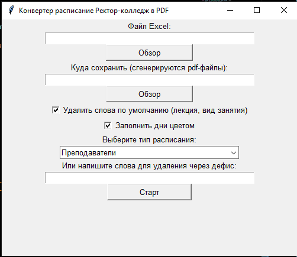
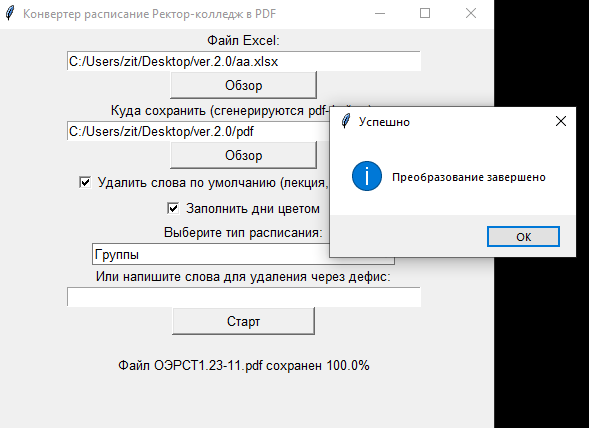
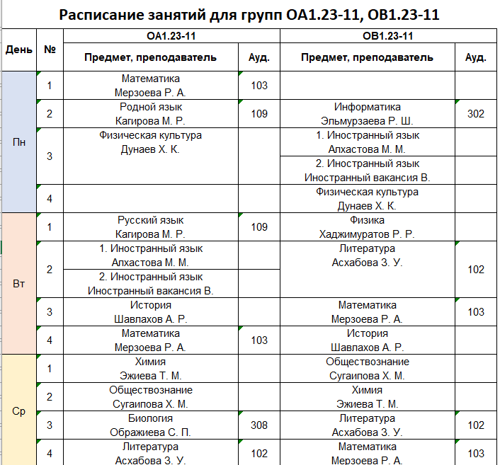

# Конвертер расписания Ректор-Колледж в PDF

Утилита для автоматического преобразования Excel-файлов расписания из системы "Ректор-Колледж" в отдельные PDF-файлы для преподавателей и групп.

## 📋 Возможности

- **Для преподавателей**: автоматическое создание отдельных листов для каждого преподавателя
- **Для групп**: очистка и форматирование расписания учебных групп
- **Удаление лишних слов**: автоматическое удаление "(лекция)", "(практика)", "вид занятия"
- **Цветовое кодирование**: автоматическая заливка дней недели разными цветами
- **Пакетная обработка**: преобразование всех листов Excel в отдельные PDF-файлы
- **Гибкие настройки**: возможность указать собственные слова для удаления

## 🚀 Установка

1. Клонируйте репозиторий:
```bash
git clone https://github.com/diiev/rector-convert.git
cd rector-convert
```

2. Установите зависимости:
```bash
pip install -r requirements.txt
```

Или установите зависимости вручную:
```bash
pip install openpyxl pywin32
```

## 📦 Зависимости

- **Python** 3.6+
- **openpyxl** - для работы с Excel файлами
- **pywin32** - для конвертации в PDF (только для Windows)
- **tkinter** - для графического интерфейса (входит в стандартную поставку Python)

## 🖥️ Использование

### Графический интерфейс

1. Запустите приложение:
```bash
python main.py
```

2. В интерфейсе:
   - Выберите исходный Excel-файл
   - Укажите папку для сохранения PDF-файлов
   - Выберите тип расписания (Преподаватели/Группы)
   - Настройте дополнительные параметры
   - Нажмите "Старт"

### Настройки обработки

- **Удаление слов по умолчанию** - автоматически удаляет "(лекция)", "(практика)", "вид занятия"
- **Заполнение дней цветом** - раскрашивает дни недели в разные цвета для лучшей читаемости
- **Пользовательские слова** - возможность указать собственные слова для удаления через дефис

## 📁 Структура проекта

```
rector-convert/
│
├── main.py              # Главный файл для запуска приложения
├── gui.py               # Графический интерфейс пользователя
├── excel_processor.py   # Обработка и форматирование Excel-файлов
├── pdf_converter.py     # Конвертация в PDF формат
├── utils.py             # Вспомогательные функции
└── requirements.txt     # Список зависимостей
```

## ⚙️ Особенности работы

### Для преподавателей
- Автоматическое определение ФИО преподавателей
- Форматирование ФИО в вид "Фамилия И.О."
- Создание отдельных листов для каждого преподавателя
- Удаление пустых строк и ячеек

### Для групп
- Очистка расписания от пустых ячеек
- Автоматическое скрытие пустых строк
- Форматирование и выравнивание содержимого
- Цветовое кодирование дней недели

## 🎨 Цветовая схема дней недели

- **Понедельник** - 🟦 Голубой
- **Вторник** - 🟧 Персиковый  
- **Среда** - 🟨 Желтый
- **Четверг** - 🟩 Зеленый
- **Пятница** - 🟪 Сиреневый
- **Суббота** - 🟥 Розовый

## ⚠️ Ограничения

- Работает только на Windows (из-за использования pywin32)
- Требует установленного Microsoft Excel для конвертации в PDF
- Поддерживает только файлы формата .xlsx

## 🔧 Разработка

Для внесения изменений:

1. Форкните репозиторий
2. Создайте ветку для вашей функции (`git checkout -b feature/AmazingFeature`)
3. Закоммитьте изменения (`git commit -m 'Add some AmazingFeature'`)
4. Запушьте в ветку (`git push origin feature/AmazingFeature`)
5. Откройте Pull Request

## 📄 Лицензия

Этот проект распространяется под лицензией MIT. Смотрите файл `LICENSE` для подробностей.

## 🤝 Поддержка

Если у вас возникли вопросы или проблемы:

1. Проверьте, установлены ли все зависимости
2. Убедитесь, что у вас установлен Microsoft Excel
3. Проверьте, что файл Excel не защищен паролем
4. Создайте issue в репозитории с описанием проблемы

## Скриншоты работы программы: 
<br>**Главное окно программы**<br>


  <br>**Процесс обработки**<br>
 

   <br>**Сформированный pdf-файл**<br>



Ссылка на exeш-ник(готовую программу): [https://github.com/diiev/rector-convert/blob/main/dist/main.exe]

---

⭐ Если этот проект был полезен, поставьте звезду на GitHub!
